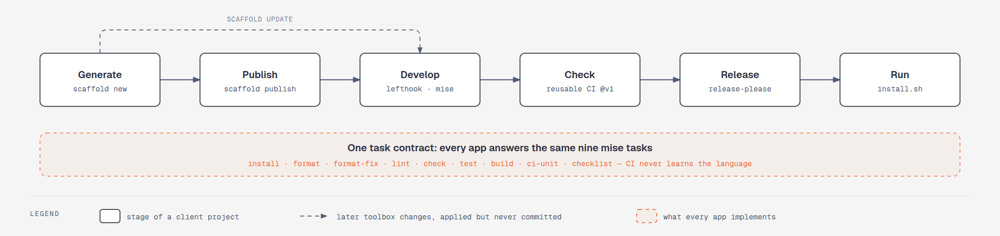

# scaffold

**Set up client projects with CI, containers, hooks, and releases in one command.**

scaffold is a bash toolbox for engineers who start client projects often. One command
generates a monorepo that is ready for its first pull request, and every project it makes is
built, checked and released the same way.

[](https://github.com/ttncode/scaffold/actions/workflows/ci.yml)
[](LICENSE)



scaffold is pre-1.0, and its versions are git tags.

---

## Commands

| What you're doing | Command | Key principle |
|---|---|---|
| Start a project | `scaffold new <name>` | One command, one commit |
| Add an app to it | `scaffold add <dir> --adapter <adapter>` | Staged, never committed for you |
| Bring in toolbox changes | `scaffold update [dir]` | Applied as a patch you review |
| Put it on GitHub | `scaffold publish [dir]` | Private by default, `main` protected |
| See what's available | `scaffold list` | The wizard reads the same list |
| Check adapters and services | `scaffold lint` | Every one meets the contract |

Run `scaffold` with no arguments for a wizard that builds the command for you. Flags and
defaults are in [Commands](docs/README.md#commands).

---

## Quick start

You need `git` and [`mise`](https://mise.jdx.dev/getting-started.html). `mise install`
supplies the rest.

```sh
git clone https://github.com/ttncode/scaffold.git
cd scaffold
mise install
export PATH="$PWD:$PATH"
```

Then generate a project somewhere outside the toolbox:

```sh
cd ~/playground
scaffold new demo-app --web nextjs --api nestjs --db postgres
```

The framework generators take a few minutes. You get a directory with one commit,
`feat: scaffold project`. The full run, from generation to a running release, is in
[Walk through a first project](docs/runbook/first-project-walkthrough.md).

<details>
<summary><b>Other requirements</b></summary>

| Needed for | Requirement |
|---|---|
| `laravel-api`, `laravel-inertia` | PHP 8.3 or later on the host ([ADR-0016](docs/decisions/0016-php-is-not-pinned-through-mise.md)) |
| `scaffold new` | A GitHub owner: `SCAFFOLD_GITHUB_OWNER`, the signed-in `gh` user, or `git config github.user` |
| `scaffold publish` | [`gh`](https://cli.github.com/), signed in |
| CI in a generated project | A `.github` repository under that owner, holding the reusable workflows ([ADR-0005](docs/decisions/0005-share-ci-through-reusable-workflows.md)) |
| Running a release | Docker |

</details>

---

## What a generated project gets

| Piece | What It Does |
|---|---|
| **Apps** | One directory per adapter you pick, each with its own `mise.toml` |
| **Task contract** | Every app answers the same nine `mise` tasks, so CI runs one command per app |
| **CI** | Five thin workflows that call shared reusable workflows at `@v1` |
| **Guardrails** | lefthook runs prettier, gitleaks and commitlint; Renovate opens dependency bumps |
| **Releases** | Release Please, container images, and an `install.sh` that runs the stack with Docker Compose |
| **Docs site** | VitePress, checked in CI like any app |
| **`.scaffold.toml`** | Records the toolbox commit that generated it, for `scaffold update` |

---

## Adapters and services

| Adapter | Flag | Tier |
|---|---|---|
| `nextjs` | `--web` | A |
| `nestjs` | `--api` | A |
| `laravel-api` | `--api` | A |
| `flask` | `--api` | A |
| `laravel-inertia` | `--app` | B |

Tier A runs on every pull request and stays green through every dependency bump. Tier B is
verified weekly and whenever its adapter changes
([ADR-0012](docs/decisions/0012-tiered-adapter-support.md)).

| Flag | Services | Default |
|---|---|---|
| `--db` | `mysql`, `postgres`, `mongodb`, `none` | `mysql` with `--api` or `--app`, otherwise `none` |
| `--cache` | `redis`, `none` | `none` |

---

## How it works

- **Overlay, not presets.** Each adapter runs the framework's own generator, then lays
  scaffold's files on top ([ADR-0003](docs/decisions/0003-adapter-overlay-instead-of-vendored-presets.md)).
- **Only what you picked.** A project gets `common/` and the adapters you chose, nothing
  else ([ADR-0004](docs/decisions/0004-keep-the-toolbox-out-of-generated-projects.md)).
- **No build orchestrator.** `mise` tasks are the only task runner
  ([ADR-0001](docs/decisions/0001-use-mise-tasks-as-the-task-runner.md),
  [ADR-0002](docs/decisions/0002-no-monorepo-build-orchestrator.md)).
- **The released stack must run.** A release has to start and serve, not just build
  ([ADR-0021](docs/decisions/0021-the-released-stack-must-run.md)).

---

## Project structure

| Path | Purpose |
|---|---|
| `scaffold` | The entry point, one function per command |
| `lib/` | The libraries it sources |
| `adapters/` | One directory per framework |
| `services/` | One directory per database or cache |
| `common/` | Copied into every new project |
| `tests/` | bats suites and fixtures |
| `docs/` | Tour, decisions, runbooks and diagrams |

---

## Why scaffold?

Client projects start the same way every time, and each hand-made setup drifts a little from
the last. scaffold turns the setup into one command and keeps it consistent: every app speaks
the same task contract, every project shares the same CI, and `scaffold update` carries later
fixes into projects that already exist.

---

## Documentation

- [Start here](docs/README.md): repository map, commands and a reading path
- [Tour](docs/tour/): how the pieces fit, in nine pages
- [Decisions](docs/decisions/): why they fit that way
- [Runbooks](docs/runbook/): what to do when something specific happens
- [Provenance](docs/PROVENANCE.md): what is copied from [immich](https://github.com/immich-app/immich)

---

## Contributing

Setup, test lanes, and how to add an adapter or a service are in
[CONTRIBUTING.md](CONTRIBUTING.md). Report vulnerabilities privately as described in
[SECURITY.md](SECURITY.md).

## Team

| | Name | GitHub | Role |
|---|------|--------|------|
|  | **Truong Trung Nghia** | [@ttncode](https://github.com/ttncode) | Creator |

## License

MIT, see [LICENSE](LICENSE). A generated project gets no license file, because its terms
belong to the engagement it was generated for.
