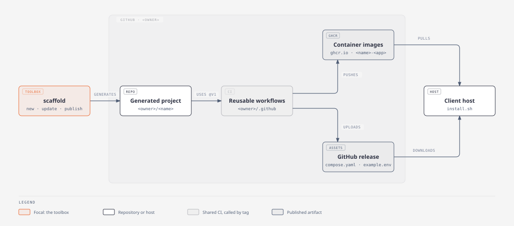
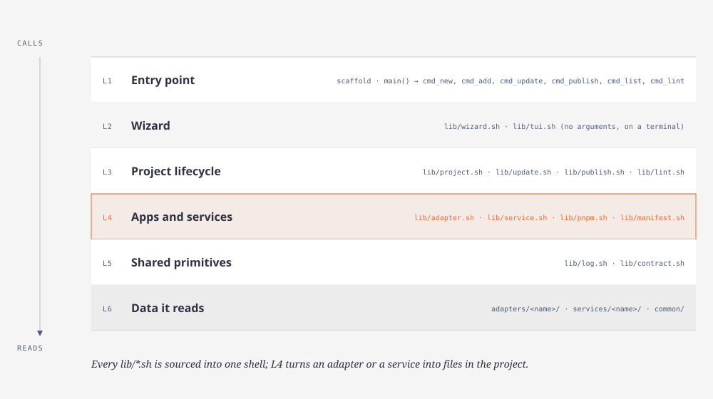
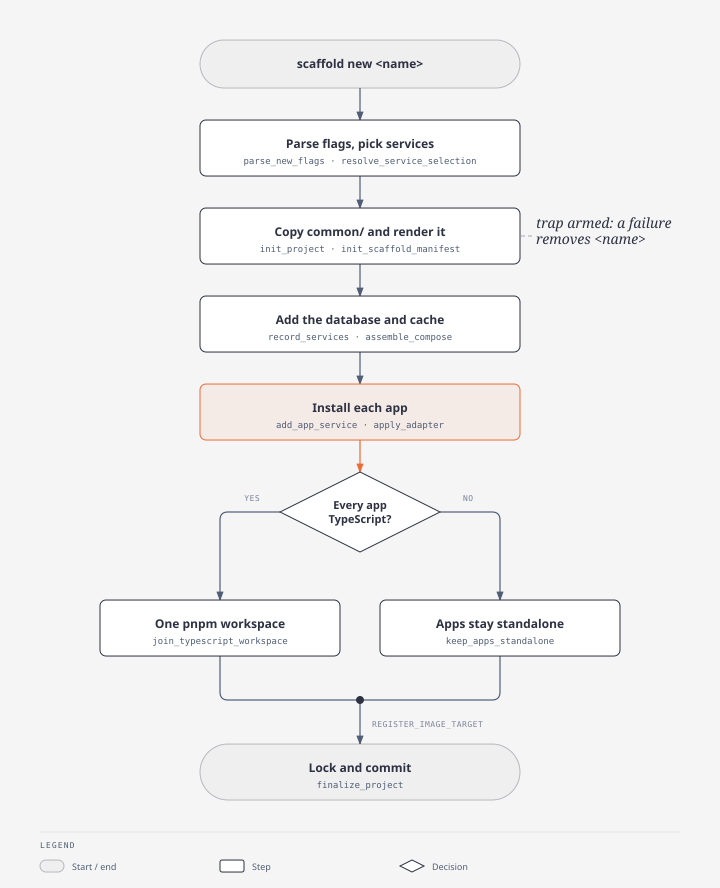
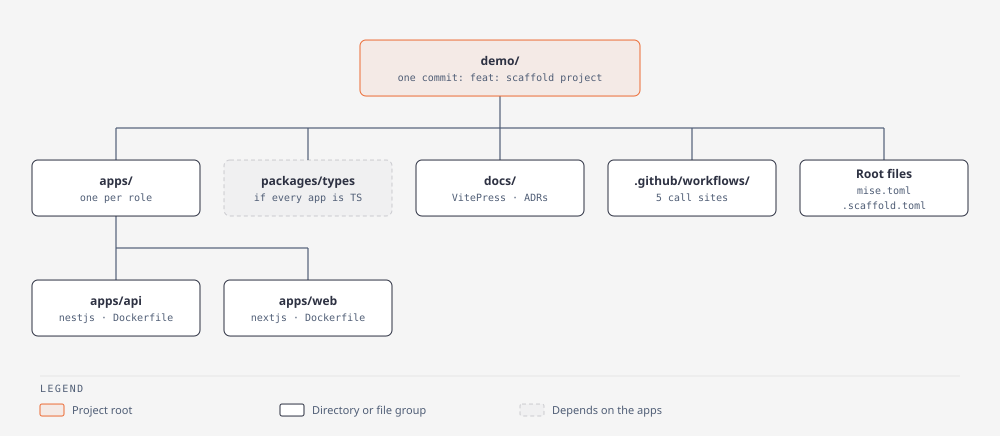

# scaffold documentation

## What scaffold is

- A bash toolbox: one `scaffold` script plus the libraries in `lib/`.
- It generates a client monorepo from `common/`, one adapter per application, and optional services.
- Every generated application implements the nine-task contract in `lib/contract.sh`.
- A generated project's CI calls this account's reusable workflows by the `@v1` tag and runs the contract per config root, so CI never learns the language.

## Repository map

| Path | Role |
| --- | --- |
| `scaffold` | Entry point: `main()` dispatches to one `cmd_*` function per command |
| `lib/` | Libraries `scaffold` sources into one shell, listed below |
| `adapters/` | One directory per framework: `adapter.env`, overlay files, a `lefthook.fragment.yml` |
| `services/` | One directory per database or cache: `service.env`, compose fragments, `drivers/`; `services/shared` is not a service but the driver bodies those `drivers/` source |
| `common/` | Copied into every new project, then rendered |
| `docs/` | This documentation: tour, decisions, runbooks, provenance, diagrams |
| `tests/` | bats suites and their fixtures |
| `scripts/` | CI helpers: adapter matrix, provenance check, deploy check |
| `.github/` | This toolbox's own workflows and pull request template |
| `.vscode/` | Editor settings and recommended extensions |
| `lib/log.sh` | `log`, `warn`, `die`, `step`, `run_quietly` |
| `lib/contract.sh` | The nine contract task names |
| `lib/lint.sh` | `scaffold lint`: adapters and services against the contract |
| `lib/adapter.sh` | Load an adapter, run its generator, overlay its files, wire its services |
| `lib/service.sh` | Compose services, host ports, service drivers |
| `lib/pnpm.sh` | The pnpm workspace and its supply-chain policy |
| `lib/manifest.sh` | `config_roots` and image targets, recorded once and derived everywhere else |
| `lib/project.sh` | Project skeleton, `.scaffold.toml`, the first commit |
| `lib/update.sh` | `scaffold update`: the patch from the recorded commit to this one |
| `lib/publish.sh` | `scaffold publish`: GitHub repository and settings |
| `lib/wizard.sh` | What the wizard asks and the command it builds |
| `lib/tui.sh` | The wizard's terminal screens |

## How `scaffold new` works

- `scaffold:parse_new_flags` and `scaffold:resolve_service_selection` read `--web`, `--api`, `--app`, `--db`, `--cache` and refuse a service with no `--api` or `--app`.
- `lib/project.sh:init_project` copies `common/`, renders `you/` and `@PROJECT_NAME@`, and arms the cleanup trap; `init_scaffold_manifest` writes `.scaffold.toml`.
- `lib/service.sh:assemble_compose` and `assemble_example_env` merge each service into the compose lanes and `example.env`.
- `scaffold:install_adapters` runs, per app, `add_app_service`, `lib/adapter.sh:apply_adapter` and `record_scaffold_app`.
- `scaffold:settle_workspace_shape` joins one pnpm workspace when every app is TypeScript, keeps apps standalone otherwise, then runs `register_image_target`.
- `lib/project.sh:finalize_project` syncs the CI roots, runs `mise lock` and commits `feat: scaffold project`.

## What a generated project contains

Measured on `scaffold new demo --api nestjs --web nextjs --db postgres`: 101 tracked files, one commit.

## Commands

| Command | Flags | Does | Decision |
| --- | --- | --- | --- |
| `scaffold` | none | On a terminal, a wizard for `new`, `update` or `publish`; elsewhere, prints usage and exits 1 | [09-wizard](tour/09-wizard.md) |
| `scaffold new <name>` | `--web`, `--api`, `--app <adapter>`; `--db`, `--cache <service>` | Generates and commits a project | [ADR-0020](decisions/0020-database-default-is-derived-from-requested-adapters.md) |
| `scaffold add <dir>` | `--adapter <adapter>` | Adds an app to an existing project and stages it | [ADR-0018](decisions/0018-add-does-not-recompute-the-typescript-workspace.md) |
| `scaffold update [dir]` | `--dry-run` | Applies toolbox changes since the commit in `.scaffold.toml`; never commits | [ADR-0023](decisions/0023-a-project-records-what-generated-it.md) |
| `scaffold publish [dir]` | `--public`, `--private` (default), `--no-protect`, `--dry-run` | Creates the GitHub repository and applies its settings | [ADR-0024](decisions/0024-publishing-a-project-is-part-of-generating-it.md) |
| `scaffold list` | `--adapters`, `--services` | Prints adapters with role and tier, services with kind | [ADR-0012](decisions/0012-tiered-adapter-support.md) |
| `scaffold lint` | none | Checks every adapter and service against the contract | [ADR-0011](decisions/0011-task-contract-names-follow-immich.md) |
| `scaffold --version` | also `-v` | `git describe` of this toolbox, `-dirty` for uncommitted edits | [ADR-0023](decisions/0023-a-project-records-what-generated-it.md) |
| `scaffold --help` | also `-h` | Prints usage | none |

| Variable | Effect |
| --- | --- |
| `SCAFFOLD_GITHUB_OWNER` | The account substituted for `you/`; otherwise `gh api user`, then `git config github.user`, else `scaffold new` refuses |
| `SCAFFOLD_VERBOSE=1` | Streams every step's output; by default a step's output is shown only when it fails |

## Glossary

| Term | Meaning | Where |
| --- | --- | --- |
| adapter | A framework's generator command plus the files overlaid on its output | `adapters/nestjs` |
| family | `ADAPTER_FAMILY`: which service driver an adapter uses (`laravel`, `nest`, `next`, `flask`) | `adapters/nestjs/adapter.env` |
| tier | `ADAPTER_TIER`: A, B or C, how often CI verifies the adapter | [ADR-0012](decisions/0012-tiered-adapter-support.md) |
| service | A database or cache: `SERVICE_KIND`, a pinned image, compose fragments | `services/postgres` |
| driver | Per-family script that wires a service into an app's code, Dockerfile and compose entry | `services/postgres/drivers` |
| config root | A directory with its own `mise.toml` that CI runs the contract in, listed in `config_roots` | [ADR-0013](decisions/0013-config-roots-is-the-manifest.md) |
| task contract | The nine tasks every app implements: `install` … `checklist` | `lib/contract.sh` |
| overlay | Copying an adapter's files over the generator's output | [ADR-0003](decisions/0003-adapter-overlay-instead-of-vendored-presets.md) |
| splice anchor | The `# @SERVICE_SETUP@` line in an adapter Dockerfile, replaced by the drivers' setup block | `adapters/nestjs/Dockerfile` |
| manifest | `config_roots` in the project's root `mise.toml`: recorded once, the CI matrix is derived from it | `lib/manifest.sh`, [ADR-0013](decisions/0013-config-roots-is-the-manifest.md) |
| `.scaffold.toml` | What generated the project: the toolbox commit and the adapter behind each app, read by `scaffold update` | [ADR-0023](decisions/0023-a-project-records-what-generated-it.md) |

## Reading path

| When | Read |
| --- | --- |
| Day one | This page, then [01-toolchain](tour/01-toolchain.md) through [03-ci](tour/03-ci.md) |
| First week | [04-guardrails](tour/04-guardrails.md) through [09-wizard](tour/09-wizard.md); ADR-0001, ADR-0003, ADR-0011 |
| On demand | The [runbook](runbook/) that names the situation |

## Diagrams

Each `.svg` is exported from the `.html` beside it.

| Diagram | Shows |
| --- | --- |
| [system-context](diagrams/system-context.svg) | Toolbox, generated project, reusable workflows, images, releases, client host |
| [code-layers](diagrams/code-layers.svg) | `scaffold`, `lib/*.sh` and the directories they read |
| [scaffold-new](diagrams/scaffold-new.svg) | The `scaffold new` call order |
| [generated-project](diagrams/generated-project.svg) | The tree `scaffold new` produces |
| [release-flow](diagrams/release-flow.svg) | Continuous builds and cut releases of a generated project |
| [scaffold-update](diagrams/scaffold-update.svg) | How `scaffold update` patches an existing project |
