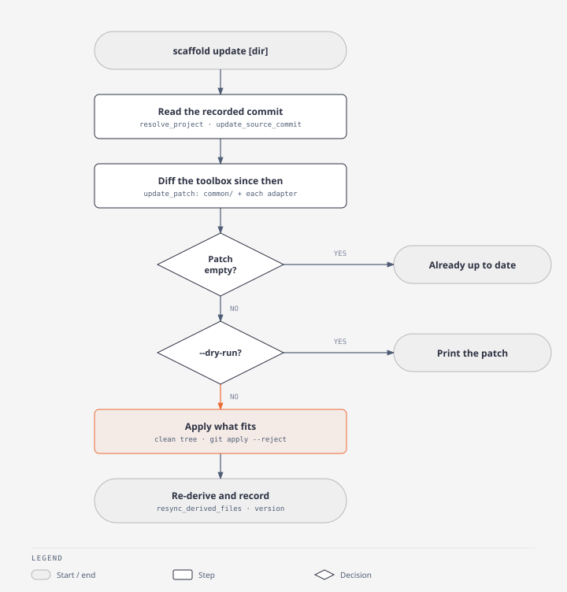

# Update a project

When: a project generated earlier should receive the toolbox changes made since.

`scaffold update` diffs `common/` and each app's adapter from the commit recorded in `.scaffold.toml` to this checkout's `HEAD`, rewrites the patch onto the project's paths, and applies it. It never commits (ADR-0023).



## Steps

1. Put the toolbox on the version to bring in, with no uncommitted edits.

   ```bash
   git -C <toolbox> pull
   git -C <toolbox> status --short    # empty
   ```

2. Commit or stash everything in the project.

   ```bash
   git -C <project> status --short    # empty
   ```

3. Preview the patch.

   ```bash
   scaffold update <project> --dry-run
   ```

4. Apply it.

   ```bash
   scaffold update <project>
   ```

   It exits non-zero when a hunk was rejected, and still records the new version: running it again would offer the applied hunks twice.

5. Resolve rejected hunks. Each `.rej` beside a file holds what did not apply. Place those hunks by hand, then delete the `.rej`.

   ```bash
   git -C <project> ls-files --others --exclude-standard -- '*.rej'
   ```

6. Review and commit.

   ```bash
   git -C <project> diff
   (cd <project> && mise run checklist)
   git -C <project> add -A
   git -C <project> commit -m "chore: update from scaffold"
   ```

## Verify

- `scaffold update <project> --dry-run` prints `already up to date with <version>`.
- `version` in `<project>/.scaffold.toml` equals `scaffold --version`.
- No `.rej` file remains.

## If it fails

| Symptom | Fix |
| --- | --- |
| `no .scaffold.toml in <project>` | The project predates the file. Write it with the toolbox commit it came from and each app's adapter, as the message shows, then run again |
| `records <version>-dirty` | The project was generated from uncommitted toolbox edits. There is no commit to diff from, so it cannot be updated (ADR-0023) |
| `this toolbox has no commit <version>` | A different clone generated the project, or history was rewritten. Run `scaffold` from a clone that has the commit |
| `has uncommitted changes` | Commit or stash, then run again |
| `<app> was generated by '<adapter>', which this toolbox no longer has` | That app is skipped; the rest applies |
| Many `.rej` files in compose and workflow files | Normal for a project that predates ADR-0022: an update moves files, not structure |
| The project's `roots:` in `ci.yml` or `images:` in `build.yml` look wrong | They are re-derived after the patch (`resync_derived_files` in `lib/update.sh`). Check `config_roots` in the project's `mise.toml` |
