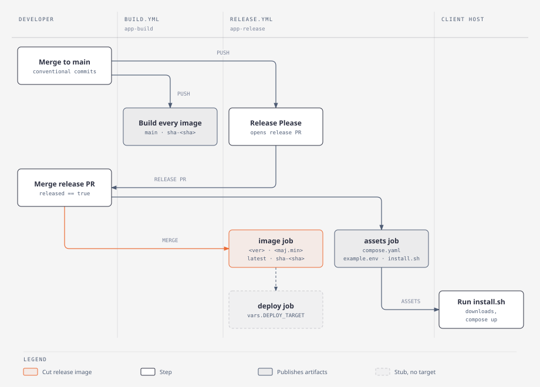

# 05 — Release

## What it does

- Commits are Conventional Commits; Release Please reads them and keeps a standing release pull request (ADR-0006).
- `build.yml` runs on every push to `main` and publishes `main` and `sha-<commit>` image tags.
- `release.yml` also runs on every push to `main`; merging the release pull request publishes the version tags (`1.4.0`, `1.4`) and `latest`.
- Build and release are separate workflows, so an ordinary merge never waits on a release (ADR-0015).



## Read this

| File | Why |
| --- | --- |
| `common/release-please-config.json` | `release-type: simple`, changelog sections |
| `common/.release-please-manifest.json` | The version Release Please last released |
| `common/.github/workflows/build.yml` | Continuous images; `images:` is written by `scaffold` (ADR-0022) |
| `common/.github/workflows/release.yml` | Release call site; passes `RELEASE_APP_ID` and `RELEASE_APP_PRIVATE_KEY` |
| `docs/runbook/cut-a-release.md` | The steps to cut one |

## Delete test

Delete `common/.github/workflows/build.yml` and an ordinary merge publishes no image.
A client on `IMAGE_TAG=main` stops getting updates.

## Try it

```bash
jq . common/.release-please-manifest.json common/release-please-config.json
```
